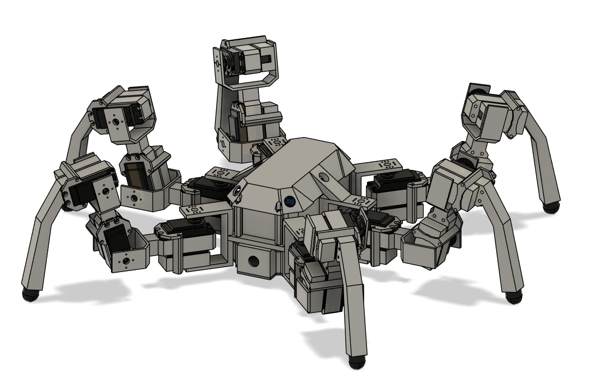
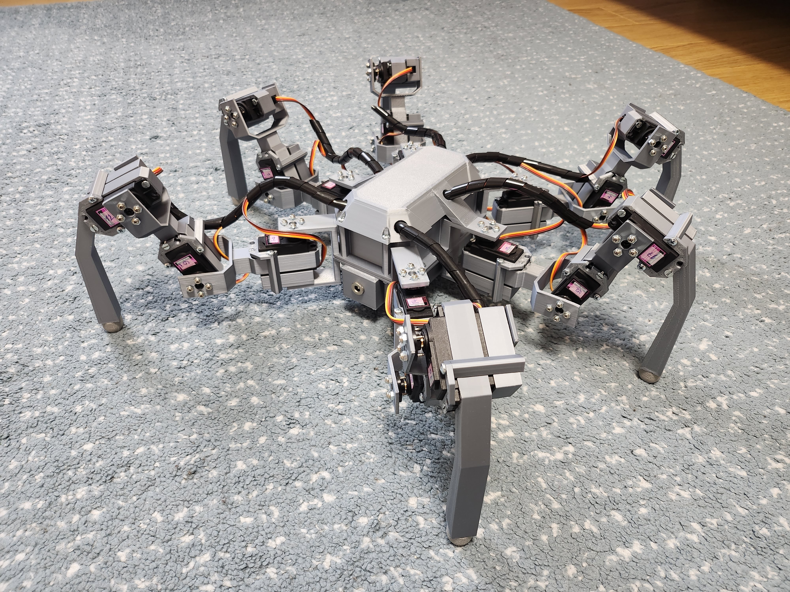

# Rob The Hexapod
Rob the Hexapod is 6-legged open source robot based on the arduino platform. It is supposed to be an evolution of [Bob The Hexapod](https://github.com/Papouc/Bob-The-Hexapod) project I worked on previously. 

Compared to it's predecessor, Rob The Hexapod has more powerful servos alongside with beefier construction. On the other hand, the electronics have been greatly simplified.

## Hardware
The robot is built mostly from 3D printed parts. Aside from common fasteners and some cable management material there isn't anything else required. 

The STEP files for 3D printing are located under [docs/3D](docs/3D) folder. In total, 77 printed parts are needed (**chassis is meant to be splitted in half during slicing**).

The motion system is based around MG996R hobby servo motors. In this configuration 18 of them are needed. Power is acquired from bottom-mounted 3S li-ion battery pack made from Sony US18650VTC5 cells.

Arduino MEGA was chosen as a brain for this robot mainly because of it's large amount of digital I/O pins (needed for servo control). Purpose of this project is to demonstrate the walking/leg motion algorithm, because of that no higher level computing unit was utilized.

### List of basic components
Key essential parts for this build are:

- Arduino MEGA board

- Mega IO shield

- HC-05 bluetooth module

- 18 MG996R servos

- XL4015 step down module

- 3 Sony US18650VTC5

- 3S BMS circuit

The electronics part follows the pattern of connecting premade modules together. As this is not an electronics project, the circuitary won't be further specified.

## Software
The entire code was written in [Arduino](https://www.arduino.cc/en/software) framework using [PlatformIO](https://platformio.org/) developement environment. It implements full 3D inverse kinematics as well as tripod walking gait in 8 directions.

The project uses object oriented C++, but it tries to be as simple as possible, thus completely ommits usage of more advanced principles and tries to minimize pointer occurrences.

### Inverse kinematics code
Implementation of IK is based on math presented in [this](docs/InverseKinematics/IkSolution.pdf) file. It is realized in [Leg.cpp](src/leg.cpp) source file along with ellipse and line interpolation. There is also a Python testing [script](docs/InverseKinematics/EllipseInterpolation.py) for ellipse interpolation located in [docs/InverseKinematics](docs/InverseKinematics).

### Bluetooth
The control is currently handled by sending character commands from arbitrary android application. Mappings for individual movements are present in [commands.h](include/commands.h) file.

## Result
Quick demo of the robot walking is available [here](https://youtu.be/5nbzhhgzTKM).

This version is improved in every way over the previous one. The overall motion is much more fluent and stable. It also has no problem walking on most surfaces thanks to it's 82A TPU feet. Fully assembled robot looks the following: 

Hope you like the project :D!!